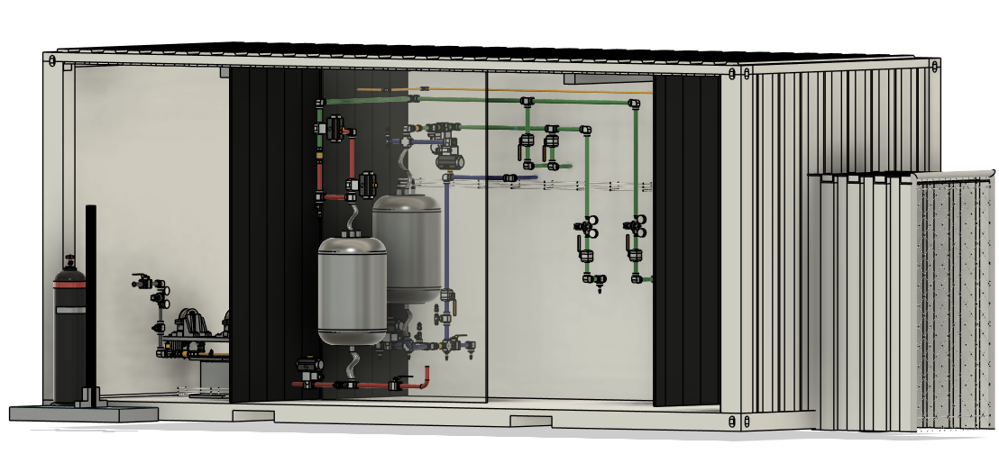
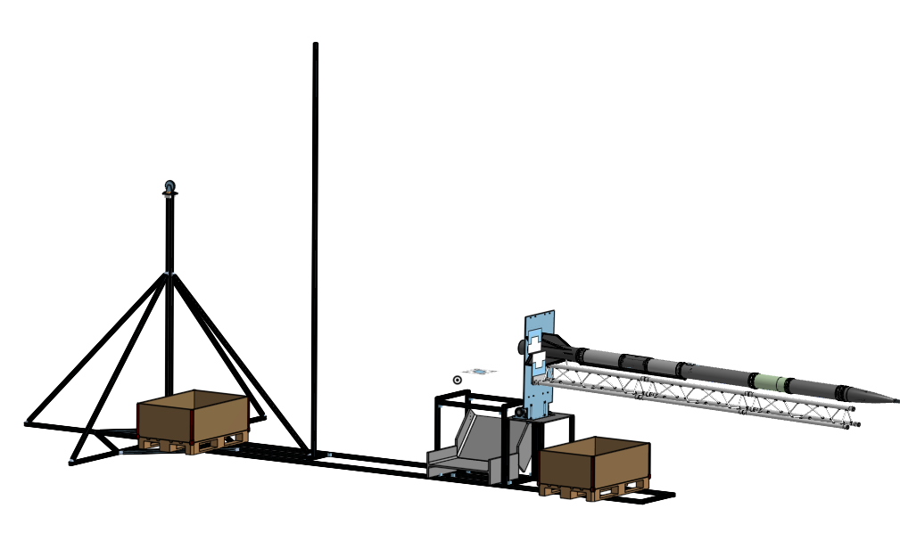
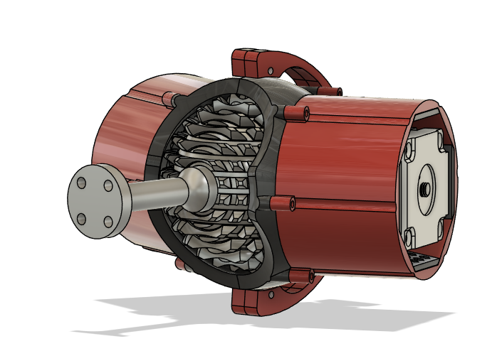
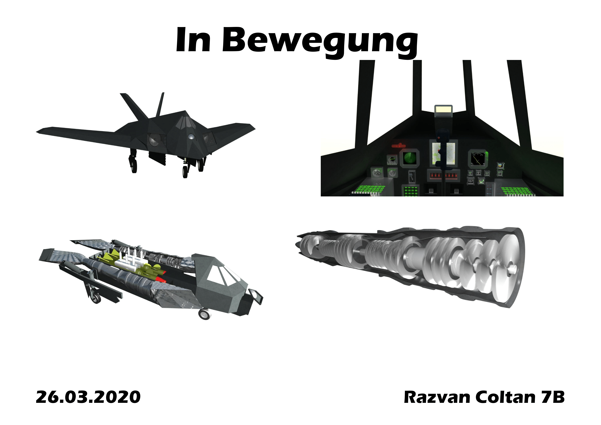

# Razvan Coltan's CAD Portfolio

This gallery showcases a selection of my mechanical design and CAD projects, demonstrating my skills in 3D modeling, design for manufacturing, and mechanical analysis.

---

### Self-Sensing Robot Link
*2025*

As my Master's semester thesis, I designed and prototyped a self-sensing robot link capable of detecting both normal and shear forces. The design was optimized for FDM 3D printing and utilizes an internal vision system with dual-color markers to interpret the applied forces in real-time.

**Software Used:** Autodesk Fusion 360

---

### ARIS Engine Test Bench (Vertical & Horizontal Stands)
*2025*

For the ARIS space program, I co-designed both a horizontal and a vertical test stand. The horizontal stand was developed for testing a bi-liquid rocket engine, while the vertical stand was designed to accommodate the entire rocket assembly. The project required a strong focus on safety protocols and design-for-cost-effectiveness.

<table width="100%" style="border:none;">
  <tr>
    <td width="50%" align="center">
      
      <em>Horizontal Test Stand</em>
    </td>
    <td width="50%" align="center">
      
      <em>Vertical Test Stand</em>
    </td>
  </tr>
</table>

**Software Used:** Onshape

---

### High-Torque Locking Ball Joint
*2024*

My Bachelor's Thesis involved the development of a novel locking ball joint. The design moves beyond traditional friction-based locks, instead utilizing a mechanical interlocking system. I engineered a sophisticated 3D geometry featuring a 360-degree spherical gear to achieve high torque resistance and positive locking.

**Software Used:** Siemens NX, Autodesk Fusion 360

---

### School Project: "My School" Amphitheater
*2021*

For this academic project, I chose to model my school's amphitheater, a complex space with significant architectural and electronic details. The goal was to create a comprehensive, true-to-scale 3D model that could be used for virtual walkthroughs and spatial planning. The final model captured intricate details of the structure and its integrated systems.

<table width="100%" style="border:none;">
  <tr>
    <td width="50%">
      
    </td>
    <td width="50%">
      
    </td>
  </tr>
</table>

**Software Used:** Bently Microstation

---

### School Project: "Im Bewegung" F-117 Nighthawk
*2020*

As an early design project, I modeled the Lockheed F-117 Nighthawk. After accurately recreating the aircraft's iconic exterior geometry, I expanded the project's scope to include detailed modeling of its internal structures and mechanical components, demonstrating a commitment to thoroughness and detail.

**Software Used:** Bently Microstation

---
