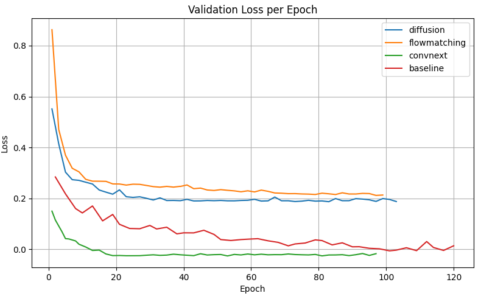

# Master Project: Human Mesh Recovery from Depth Maps

This project, undertaken as part of my Master's studies, focused on advancing the state-of-the-art in 3D Human Mesh Recovery (HMR). As a team of three, we significantly enhanced an existing AI model (ProHMR) to reconstruct full 3D human meshes with higher accuracy using only a single depth map as input.

### The Challenge

Reconstructing a 3D person from a 2D image is notoriously difficult due to depth ambiguity and visual occlusions. While using depth maps provides a better geometric foundation than standard RGB images, existing models still had significant room for improvement. The goal was to modernize a depth-based HMR framework to set a new performance benchmark for applications in AR/VR, robotics, and Human-Computer Interaction.

---

### My Approach & Contributions

My primary role was to **research and validate the replacement of the model's core component: its image feature extractor.** I conducted the initial research and experiments that proved swapping the outdated ResNet (2015) backbone with the modern **ConvNeXt (2022)** architecture was the most effective path to improving performance. This foundational work provided the basis for our model's primary success.

I also took the lead in communicating our team's achievements by **authoring the comprehensive final report**, ensuring our methodology, experiments, and conclusions were documented clearly for the academic community.

  
   
  <em>Our model delivering an accurate pose (109.0mm error).</em>
    
  
   
  <em>Our model handling a challenging, unusual pose (193.8mm error).</em>

 

> *Image Description: Qualitative results showing our enhanced model's predictions on various challenging poses.*

---

### Training & Convergence Analysis

A key finding from my research was the dramatic improvement in training efficiency. As shown by the validation loss curves, our ConvNeXt-based models converged significantly faster (around epoch 40-50) and more stably than the original ResNet baseline, which struggled to converge even after 100 epochs. This highlights the superior learning dynamics of the modern architecture.

  

---

### Key Achievements

* **Pioneered the key architectural upgrade** by researching and testing the integration of the **ConvNeXt** backbone, which was the single largest driver of the model's performance boost.
* **Dramatically improved reconstruction accuracy**, reducing the Global Mean Per-Joint Position Error (G-MPJPE) by over **20%** (from 108.1mm to 85.6mm) compared to the fully trained baseline.
* **Boosted training efficiency by 3x**, implementing optimizations to the SMPL-X mesh generation process that reduced iteration time from 8.3 minutes to just 2.5 minutes.
* **Enhanced model stability**, re-enabling and validating a discriminator with adversarial loss, which encouraged more realistic human poses and measurably improved results.
* **Conducted deep failure analysis**, identifying that the model's primary limitation was not the architecture but a hardcoded cropping step in the data pipeline, demonstrating a thorough understanding of the entire system.

### Ablation Study: Component Impact

The following table breaks down the impact of each architectural change made during the project. The results clearly show that while each component contributed, the **introduction of the pre-trained ConvNeXt backbone provided the most significant leap in performance** across all metrics.

| Model           | G-MPJPE ↓ | MPJPE ↓ | PA-MPJPE ↓ | V2V ↓ |
| :-------------- | :-------: | :-----: | :--------: | :---: |
| Baseline        |   126.2   |  85.9   |    58.6    | 103.2 |
| +Adv            |   118.1   |  82.4   |    57.3    | 98.8  |
| **+ConvNeXt** |  **87.4** |**65.7** |  **48.6** |**75.6**|
| +Diffusion      |   85.6    |  65.7   |    46.9    | 80.0  |
| +FlowMatching   |   87.7    |  65.3   |    48.2    | 76.2  |

---

### Failure Case Analysis

<table align="center" style="width:100%; border:none;">
  <tr>
    <td align="center" width="50%">
      
       
      <em>Baseline Model Failure (490.6mm Error)</em>
    </td>
    <td align="center" width="50%">
      
       
      <em>Our Model Failure (243.1mm Error)</em>
    </td>
  </tr>
</table>

> *Image Description: An example of our failure case analysis. Both the baseline (left) and our model (right) failed to reconstruct a seated person, defaulting to a standing pose. My analysis traced this error back to a flawed data preprocessing step, highlighting a key area for future improvement.*

---

### Core Technologies & Skills

* **Deep Learning:** PyTorch, Generative Models (Diffusion, Normalizing Flows)
* **Computer Vision:** 3D Human Mesh Recovery (HMR), Depth Data Processing, SMPL-X Body Models
* **AI Architectures:** ConvNeXt, ResNet
* **Technical Leadership:** Research & Development, Experimental Design, Technical Documentation & Reporting

* [Back to Main Page](../README.md)
