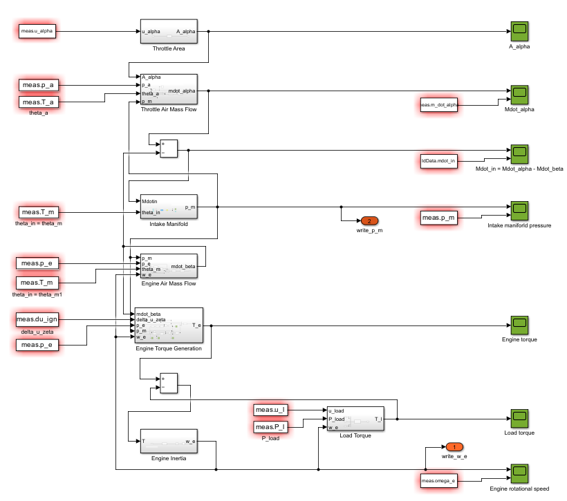

# Master Project: Engine Idle Speed Controller Design

This was a comprehensive, hands-on project focused on designing a model-based idle speed control system (ISCS) for a 2.5-liter, 5-cylinder SI engine. The goal was to develop a robust, multi-input controller that could maintain a stable engine speed during sudden load disturbances, preventing the engine from stalling. The entire project was developed in MATLAB and Simulink.

  

> *Image Description: The complete engine model developed in Simulink, showing the interconnected subsystems from the throttle to the engine inertia.*

---

### The Challenge

[cite_start]Modern engines use very low idle speeds (around 700 rpm) to minimize fuel consumption. [cite_start]This makes them highly susceptible to stalling when sudden torque disturbances occur, such as an air conditioning compressor turning on. [cite_start]The challenge was to design a controller that could react instantly to these disturbances by managing both the throttle position and ignition timing in a coordinated manner.

---

### My Approach & Contributions

[cite_start]As part of a small team, I followed a structured, four-milestone process to develop the controller from first principles.

1.  [cite_start]**Mathematical Modeling:** First, I developed a comprehensive mathematical model of the engine in MATLAB & Simulink. [cite_start]This involved creating dynamic models for all key subsystems, including the throttle body, intake manifold, engine torque generation, and rotational inertia, based on physical equations.

  

> *Image Description: A detailed look inside the Engine Torque Generation subsystem, implementing the Willans approximation and accounting for ignition timing delays.*

2.  [cite_start]**Parameter Identification:** Using real-world measurement data from a physical engine test bench, I performed system identification to calibrate the model. [cite_start]This involved using both linear least-squares methods and nonlinear optimization (`fminsearch`) to accurately determine unknown parameters like engine inertia, thermodynamic efficiencies, and intake manifold volume. [cite_start]The success of this phase is demonstrated by the close match between our simulated model and the measured engine data.

  

> *Image Description: A comparison plot showing the strong correlation between the real measured engine data (blue) and the output of our calibrated Simulink model (yellow), validating the accuracy of our system identification.*

3.  [cite_start]**Controller Synthesis:** With the validated model, I linearized it around a nominal idle speed to create a state-space representation. [cite_start]Based on this linear model, I designed and tuned a multi-variable **LQGI (Linear-Quadratic-Gaussian with Integral action)** controller to manage the throttle and ignition timing outputs.

4.  [cite_start]**Validation & Competition:** The final controller was rigorously tested in simulation against various load disturbances. [cite_start]It was then deployed on the physical engine test bench at the IDSC lab for final validation and to compete against controllers from other teams.

---

### Core Technologies & Skills

* **Software:** MATLAB, Simulink
* **Control Systems:** Model-Based Control, LQGI Controller Design, State-Space Models, Linearization, System Identification
* **Engine Dynamics:** Modeling of engine torque, air path, and rotational dynamics.
* **Data Analysis:** Parameter identification from experimental data using linear and nonlinear optimization techniques.

* [Back to Main Page](../README.md)
