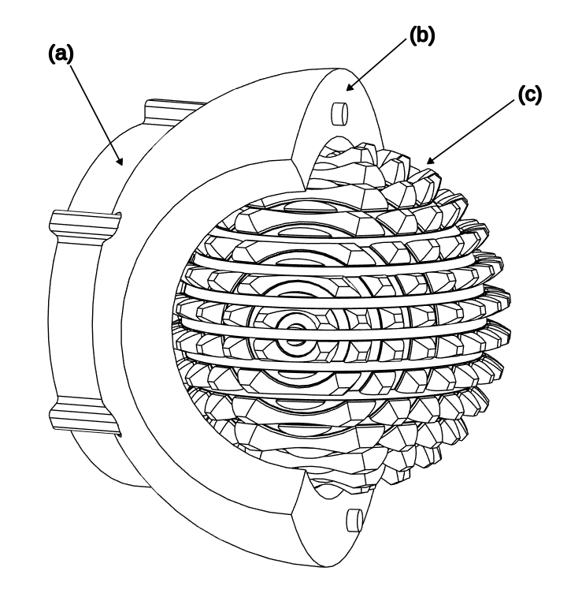
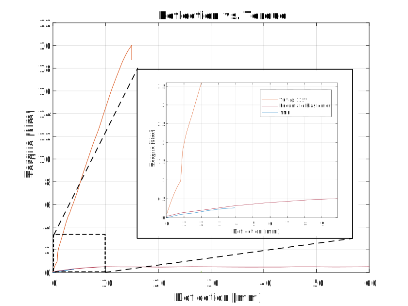

# Bachelor Thesis: Novel High-Torque Locking Ball Joint

For my bachelor's thesis, I single-handedly designed, prototyped, and validated a novel, high-performance locking ball joint for robotics. The project addressed a critical weakness in modern robotics: the inability of most robotic joints to withstand high torques, which limits their use in demanding applications.

  

> *Image Description: This figure shows the Gear Ball Joint in an exploded view with its components labeled as follows: (a) - Gear Ball, (b) - Mounting Bracket, (c) - Outer Shell, (d) - Brake, (e) - Brake Cover, (f) - Stepper Motor, (g) - M5 Lead Screw, (h) - End Effector*

---

### The Challenge

Most locking ball joints used in research for applications like wearable or walking robots are surprisingly weak, often failing at torques below 1 Nm. This severely limits their real-world utility. The challenge was to engineer a new, compact, and efficient locking ball joint from the ground up that could dramatically outperform these existing solutions.

The primary design goals were:
* **High Holding Torque:** Withstand over 10 Nm for a plastic prototype and project to over 250 Nm for a steel version.
* **Fast & Efficient Actuation:** Lock and unlock quickly with minimal power consumption.
* **Compactness & Simplicity:** Ensure the design was small, lightweight, and easy to maintain.

---

### My Design Process & Solution

After analyzing existing concepts, I chose a mechanical, gear-based locking mechanism as the most promising path for high torque resistance. My design process was highly iterative, starting with an initial concept prototype.

    

> *Image Description: The first prototype of the gear ball, which formed the basis of the design.*

From this starting point, I systematically prototyped and evaluated four different actuation mechanisms (Solenoid/Spring, Servo/Lead Screw, Pneumatic, DC Motor) before selecting a **non-captive pancake stepper motor**. This choice provided the best combination of compact size, high precision, and crucial safety features. I also solved critical design challenges like the "drawer effect" (self-wedging) and performed force calculations using the **Lewis Form Factor** to ensure the gear teeth could withstand extreme loads.

---

### Key Achievements

* **Engineered a prototype that achieved ~20 Nm of holding torque**—over **40 times stronger** than comparable academic designs which were limited to less than 0.5 Nm.
* **Designed for extreme efficiency**, requiring **200 times less actuation torque** (10 Nmm vs. 4 Nm) to engage than an equivalent commercial steel joint.
* **Projected industrial-grade performance**, calculating a theoretical holding torque of **over 700 Nm** for a CNC-machined steel version based on material properties and force analysis.
* **Conducted a rigorous, iterative design process**, systematically prototyping and testing multiple actuation systems and tooth geometries to find the optimal configuration.
* **Authored a comprehensive 40-page thesis** detailing the entire research, design, and validation process.

  

> *Image Description: Performance graph showing my design (orange line) is significantly stiffer and stronger than other state-of-the-art locking mechanisms.*

---

### Core Technologies & Skills

* **Mechanical Design:** 3D CAD (Fusion 360), Geometric Dimensioning & Tolerancing (GD&T), Design for Manufacturability (DFM).
* **Mechanical Analysis:** Classical Mechanics (Lewis Form Factor, Frictional Force Calculations).
* **Prototyping:** FDM 3D Printing (PLA), System Integration (Arduino, Stepper Motors & Drivers).
* **Experimental Validation:** Designing and executing physical test procedures using a Zwick universal testing machine.

* [Back to Main Page](../README.md)
