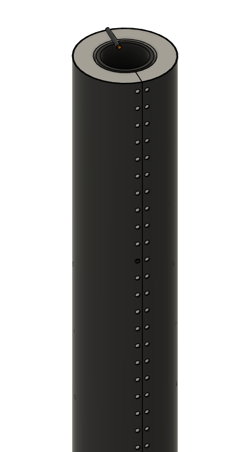
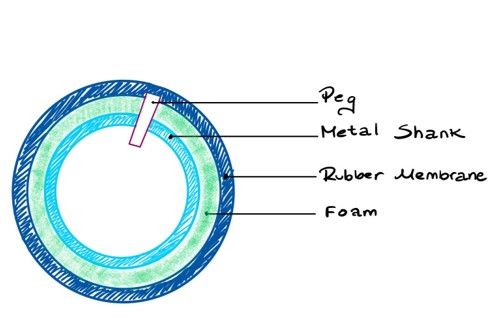
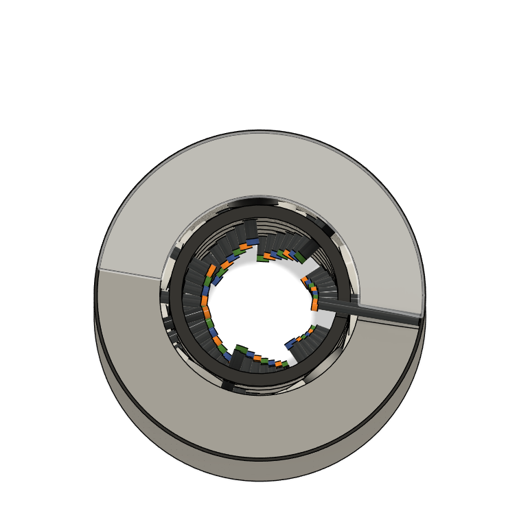

# Semester Thesis: Self-Sensing Robot Link

This project, my semester thesis at ETH Zurich, involved the complete design, fabrication, and validation of a novel, large-area tactile sensor for robotic limbs. The goal was to give robots a sophisticated sense of touch, similar to human skin, using a robust, vision-based approach.

### Core Design

<table align="center">
  <tr>
    <td align="center" width="33%">
      
       
      <em>Full CAD model of the sensor assembly.</em>
    </td>
    <td align="center" width="33%">
      
       
      <em>Conceptual schematic of the core components.</em>
    </td>
    <td align="center" width="33%">
      
       
      <em>Top-down view showing the internal marker arrangement.</em>
    </td>
  </tr>
</table>

---

### The Challenge

Modern dynamic robots, especially legged ones like ANYmal, are often "numb." They lack comprehensive tactile feedback across their bodies, making it difficult for them to interact safely and effectively with unstructured environments. They can't reliably detect incidental contact, which is critical for operating alongside people or navigating complex terrain.

---

### My Solution & Contributions

I developed a durable and scalable solution called the "Self-Sensing Robot Link." The system works by using a single internal camera to monitor an array of colored markers embedded within a compliant outer skin. When an external force is applied, the skin deforms, causing the markers to move.

My core contribution was to **design and implement the entire computer vision pipeline using Python and OpenCV**. This software tracks the displacement of the markers in real-time to determine the location and nature of the contact force.

> *Image Description: A screenshot of the live camera feed from inside the sensor. The image shows the OpenCV software successfully identifying and tracking the colored markers with bounding boxes as forces are applied.*

---

### Key Achievements

* **Developed a complete computer vision system** in **Python** with **OpenCV** to track multiple colored markers, converting physical forces into quantitative data.
* **Successfully distinguished between normal (pushing) and shear (rubbing) forces** by analyzing the unique displacement patterns of the internal markers.
* **Achieved the target pressure sensitivity of 5 kPa**, enabling the sensor to detect very light, incidental contact, a key requirement for safe human-robot interaction.
* **Engineered a highly durable and shock-resistant design**, which was validated through a 10.5-meter drop test (25.7 J impact energy) that resulted in only minimal damage.
* **Validated the design's scalability** by successfully creating and testing a version scaled down to the 32mm diameter of an ANYmal robot leg, proving the fabrication method is adaptable to different form factors.
* **Designed and fabricated all mechanical components**, including a modular assembly jig and custom tools, to ensure precise and repeatable construction.

> *Image Description: An image displaying the custom 3D-printed probes (wedge, ball-head, flat heads) used to apply controlled normal and shear forces during experimental validation.*

---

### Core Technologies & Skills

* **Programming:** Python
* **Computer Vision:** OpenCV (Color Space Conversion, Morphological Operations, Contour Detection, Centroid Tracking)
* **CAD & Prototyping:** Parametric CAD Design, 3D Printing, Material Selection (Polyurethane-Ether Foam)
* **System Design:** Mechanical System Integration, Proof-of-Concept Development, Experimental Validation

* [Back to Main Page](../README.md)
