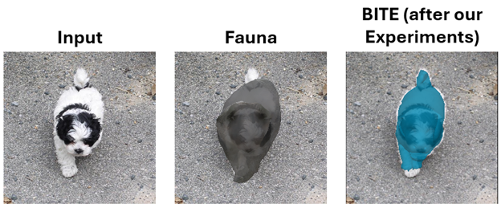
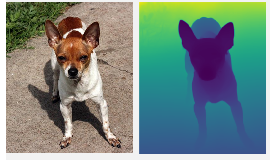
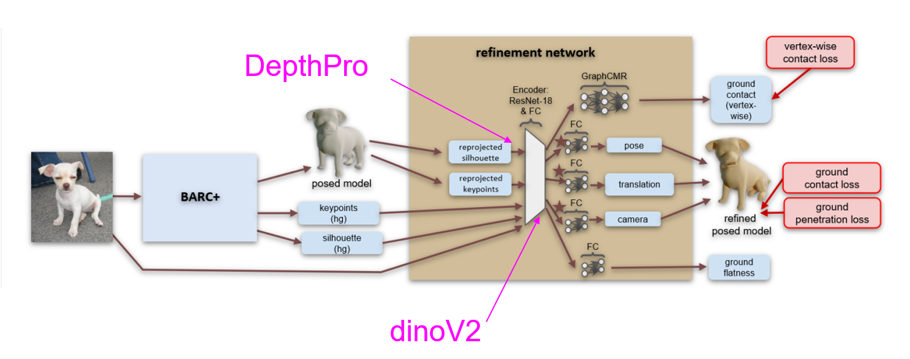
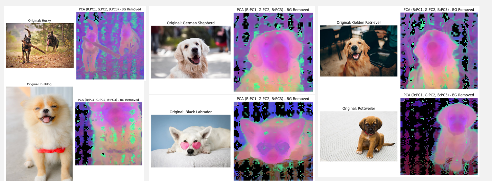

# Master Project: Enhancing 3D Animal Reconstruction with Depth Data

This team project aimed to improve upon BITE, the state-of-the-art model for reconstructing 3D dog meshes from a single 2D image. The core challenge in this field is the lack of 3D training data and the high variability in dog shapes and poses. Our goal was to enhance the BITE model's performance by introducing new data modalities, specifically depth maps and advanced semantic features.

  

> *Image Description: A qualitative comparison showing the input image, an older model (Fauna), and the output from our enhanced BITE model, which produces a much more accurate silhouette.*

---

### The Challenge

Inferring a complete 3D model, or mesh, from a single 2D image is an inherently difficult problem. For animals, this is even harder due to their non-rigid nature and wide variety of shapes. Our goal was to create a model that could reliably generate realistic 3D meshes like the one below.

  

> *Image Description: An example of the target 3D animal mesh we aimed to reconstruct.*

---

### My Approach & Contribution: Integrating Depth Maps

My primary contribution to this project was to **integrate a new input modality: depth**. While the original BITE model relies on RGB data, I hypothesized that adding explicit geometric information from a depth map could improve performance.

My implementation involved:
1.  **Generating Depth Data:** I used the **DepthPro** model to create a high-quality estimated depth map for every single-view image in our training and evaluation datasets.
2.  **Modifying the Network:** I adapted the BITE model's backbone to accept and process this new depth map as an additional input channel. This provided the network with crucial geometric cues that are not always obvious from RGB data alone.

  

> *Image Description: An example of my pipeline generating a depth map (right) from a single RGB image (left) using the DepthPro model.*

Our team's full experimental framework augmented the baseline BITE model with these depth maps alongside other advanced semantic features extracted using DINOv2.

  

> *Image Description: Our team's proposed architecture, showing how my DepthPro pipeline and other features like DINOv2 feed into the main BITE model.*

---

### Results & Analysis

Our experiments, though conducted with limited training time, showed the clear potential of our approach.

On 2D silhouette accuracy, our enhanced model achieved a higher **Intersection over Union (IoU)** score than both the Fauna model and the reimplemented BITE baseline on the StanfordExtra dataset.

| Metric                 | Fauna | BITE (reimplemented) | BITE (after our Experiments) |
| :--------------------- | :---: | :------------------: | :--------------------------: |
| IoU mean               | 0.579 |        0.913         |            0.914             |
| IoU median             | 0.604 |        0.914         |            0.916             |
| IoU standard deviation | 0.121 |        0.023         |            0.024             |

For the more complex 3D metrics on the Animal3D dataset, our model showed a slight performance regression. We attribute this to the very limited training time, which was not sufficient for the model to fully learn how to leverage the new depth information for complex 3D shape prediction.

| Metric             | BITE (reimplemented) | BITE (after our Experiments) |
| :----------------- | :------------------: | :--------------------------: |
| Scan→Mesh (mean)   |         4.93         |             5.32             |
| Mesh→Scan (mean)   |         6.85         |             7.08             |

Overall, the results validate that augmenting state-of-the-art models with depth data is a promising direction for future research, warranting further investigation with more resources.

  

> *Image Description: A visualization of the rich semantic features extracted by the DINOv2 model, another modality our team explored to enhance the network's understanding of the image.*

---

### Core Technologies & Skills

* **Deep Learning:** PyTorch, ResNet
* **3D Computer Vision:** 3D Pose Estimation, Monocular Depth Estimation (DepthPro)
* **Model Integration:** Modifying existing neural network architectures (BITE) to accept and process multi-modal input (RGB + Depth).
* **Data Pipelines:** Generating and processing large datasets for model consumption.

* [Back to Main Page](../README.md)
